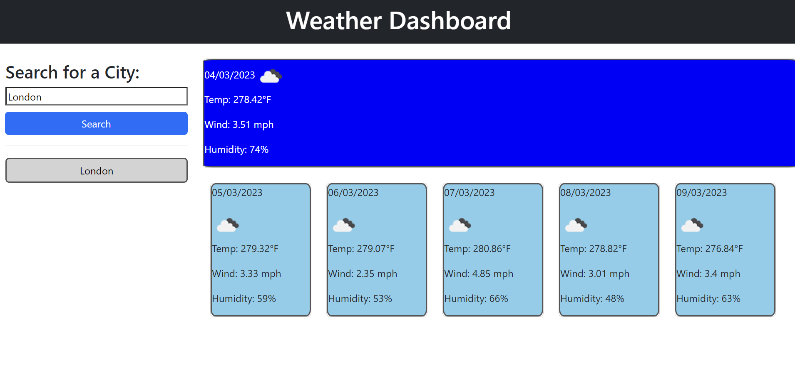
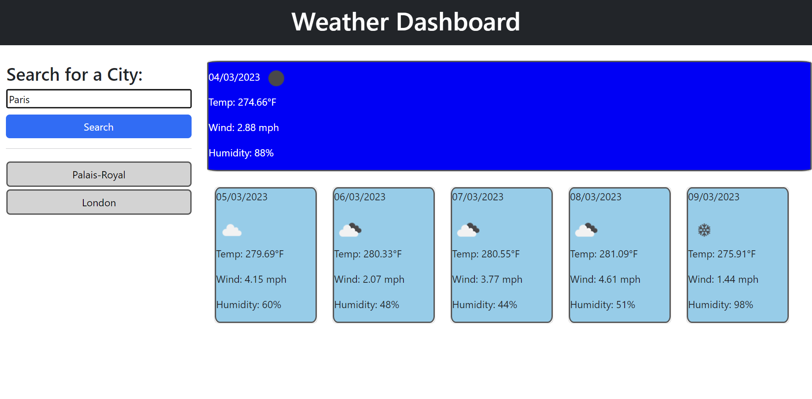

# Weather-Dashboard

An up to date weather widget that displays the current and future weather based on searched locations

## Table of Contents

* [Description](#description)

* [Installation](#installation)

* [Usage](#usage)

* [Screenshots](#screenshots)

* [Links](#links)

* [Credits](#credits)

* [License](#license)

## Description

This project is a weather dashboard that displays the current and future weather based on searched locations. The user can search for a city and the current weather will be displayed. The current weather will display the city name, the date, an icon representation of weather conditions, the temperature, the humidity, and the wind speed. The future weather will display the date, an icon representation of weather conditions, the temperature, and the humidity. The user can search for multiple cities and the search history will be displayed on the left side of the page. The user can click on a city in the search history and the current and future weather will be displayed for that city. The application uses the OpenWeather API to retrieve weather data for cities. The application runs in the browser and features dynamically updated HTML and CSS powered by jQuery.

## Installation

To install this project, clone the repository to your local machine.

## Usage

To use this project, open the index.html file in your browser.

## Screenshots

## Links

* [Repository](https://github.com/Room4Renzo/Weather-Dashboard)
* [Deployed Application](https://room4renzo.github.io/Weather-Dashboard/)

## Credits

Made by: Room4Renzo

## License

MIT License
